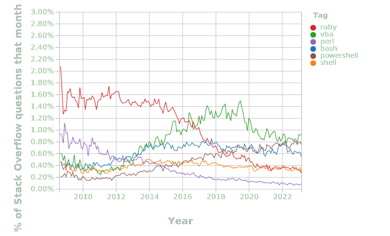

Ana and Bob work at the same company, both platform engineers. Ana's focus is to enable a specific cloud offering to internal developers in a secure and compliant way; Bob's focus is at the network level, to secure the enterprise perimeter and manage the internal address space for fair usage.

Ana knows the current process: she has to raise a request to Bob's team with the subnet size, billing information and an explanation if the subnet is larger than the pre-approved sizes. She also knows this is not ideal.

In a morning meeting, where Ana and Bob join to discuss an improvement around the process.

Picture this: you're in a discussion to solve a platform problem. It could be to allow internal users to provision a new protected resource or change a shared resource/configuration. Someone then says:

> we can simply create a script and run it on a pipeline to solve this.

No, we can't.

<!--more-->

## Testing the waters

You're not alone. Loose/duck-typed languages are everywhere in the market. The April 2023 TIOBE index shows such languages in the top 50:


| Position | Language     | Rating |
|----------|--------------|--------|
| 1        | Python       | 14.51% |
| 6        | Visual Basic | 04.40% |
| 7        | Javascript   | 02.10% |
| 18       | Ruby         | 00.66% |
| 25       | Perl         | 00.44% |
| 30       | Lua          | 00.33% |
| 40       | PowerShell   | 00.22% |
| 42       | Bourne Shell | 00.21% |
| 50       | Bash         | 00.17% |


Although those look like very low percentages, they are expressive. For instance, #10 Go has 1.28% and while #19 Rust has 0.63%.

Another perspective is the StackOverflow survey that shows figures around:

## Script ambivalence

Don't get me wrong: I love scripting languages. I use them extensively to glue repetitive tasks within my host and some small scale contexts as my lab/team environment.

Anything beyond that becomes the DevOps-certified version of spaghetti code. Script A uses script B that uses tool C, all cleverly glued together in a pipeline. A castle of cards that no one dares to touch unless it is already broken.

The problem here is that scripts don't scale. They are a loose amalgamation of weak interfaces between multiple files and command-line tools that rely on mystical or just hard-to-read functionality. Error checks, if present, are either textual or outright ignored. They are hard to maintain and extend. Dependencies on hardcoded binaries and URLs makes it harder to test, which is seldom done. Loose typing, or duck typing at best, adds yet another layer of errors to keep track of. In general, the confidence to introduce change is low.

In the past few years I've noticed a common pattern on platforms: they all rely too much on scripts. You may recognize some of those:

- network team manages critical policies and configurations with some Bash and PowerShell
- governance team has their "kit" of scripts running in a manually triggered pipeline to provision a team environment
- configuration stored as low-structured files (and I've even seen Markdown used for this as recommended by a consultant engineer from one of the Big Five companies, believe it or not…), parsed both from and to using Bash/PowerShell
- a Bash "framework" to deal with tooling and development environment

Of all those points, the last one sounds like a legit use case. All others are outright proofs-of-concept that slipped into production somehow.

What about containers? They further augment the problem. You either end up with:

- a master script or pipeline that runs a couple of different images, which you need to configure all the environment variables and mounts to work properly + deal with permission issues
- a bloated "job" container that has a ton of utilities installed, and thus is equivalent to the original environment used

What's the alternative then? Software engineering using a strong typed and preferably compiled language. Those allow developers to safely glue distinct APIs and test the intent effectively. A clean architecture won't take much more time than any thousand-line-sized script. The trade off is where the speed is: scripts are faster to create and slow to maintain, while a proper application is slower to create and fast to change.

Companies rely on such solutions, including big corporations, to deliver critical integrations and services every day. And they struggle to keep the show on the road because of those.
